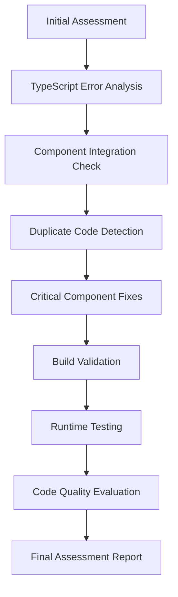

# FloorPlanner Application Testing and Evaluation Design

## Overview

This design document outlines the systematic approach to testing, debugging, and evaluating the FloorPlanner application. The design focuses on identifying and resolving TypeScript errors, component integration issues, duplicate code, and providing a comprehensive quality assessment.

## Architecture

### Testing and Evaluation Pipeline



### Error Resolution Strategy

1. **Static Analysis Phase**: TypeScript compilation, linting, import validation
2. **Component Analysis Phase**: Interface validation, prop checking, store integration
3. **Runtime Validation Phase**: Application loading, feature testing, error monitoring
4. **Quality Assessment Phase**: Robustness, modularity, scalability evaluation

## Components and Interfaces

### 1. TypeScript Error Resolution System

**Purpose**: Systematically identify and fix all TypeScript compilation errors

**Key Components**:

- Environment variable type definitions
- Store interface consistency validation
- Component prop type validation
- Import path resolution
- Missing dependency detection

**Interface**:

```typescript
interface TypeScriptErrorResolver {
  analyzeErrors(): CompilationError[];
  fixEnvironmentTypes(): void;
  validateStoreInterfaces(): void;
  resolveImportPaths(): void;
  generateTypeDefinitions(): void;
}
```

### 2. Component Integration Validator

**Purpose**: Ensure all components interface correctly with each other

**Key Components**:

- Store-component interface validation
- Prop type consistency checking
- Circular dependency detection
- State synchronization validation
- Event handling verification

**Interface**:

```typescript
interface ComponentIntegrationValidator {
  validateStoreIntegration(): IntegrationIssue[];
  checkPropConsistency(): PropIssue[];
  detectCircularDependencies(): DependencyIssue[];
  validateStateSync(): StateSyncIssue[];
}
```

### 3. Duplicate Code Eliminator

**Purpose**: Identify and consolidate duplicate code across the application

**Key Components**:

- Component duplication detection
- Utility function consolidation
- Type definition unification
- Import optimization
- Code pattern analysis

**Interface**:

```typescript
interface DuplicateCodeEliminator {
  detectDuplicateComponents(): DuplicationReport[];
  consolidateUtilities(): ConsolidationPlan[];
  unifyTypeDefinitions(): TypeUnificationPlan[];
  optimizeImports(): ImportOptimization[];
}
```

### 4. Critical Component Fixer

**Purpose**: Fix specific problematic components (LayersPanel, PropertiesPanel)

**Key Components**:

- PropertiesPanel error resolution
- LayersPanel functionality restoration
- Store integration fixes
- UI component compatibility
- Form validation improvements

**Interface**:

```typescript
interface CriticalComponentFixer {
  fixPropertiesPanel(): ComponentFix[];
  fixLayersPanel(): ComponentFix[];
  validateStoreAccess(): StoreAccessFix[];
  ensureUICompatibility(): UICompatibilityFix[];
}
```

### 5. Application Functionality Tester

**Purpose**: Validate that the application loads and functions correctly

**Key Components**:

- Application startup validation
- UI rendering verification
- Feature interaction testing
- 2D/3D view switching
- Drawing tool functionality
- Panel management testing

**Interface**:

```typescript
interface ApplicationFunctionalityTester {
  testApplicationStartup(): StartupTestResult;
  validateUIRendering(): RenderingTestResult;
  testFeatureInteractions(): InteractionTestResult[];
  validateViewSwitching(): ViewSwitchTestResult;
  testDrawingTools(): DrawingToolTestResult[];
}
```

### 6. Code Quality Evaluator

**Purpose**: Provide comprehensive assessment of code quality metrics

**Key Components**:

- Robustness assessment
- Code quality analysis
- Modularity evaluation
- Scalability assessment
- Performance analysis

**Interface**:

```typescript
interface CodeQualityEvaluator {
  assessRobustness(): RobustnessScore;
  analyzeCodeQuality(): CodeQualityScore;
  evaluateModularity(): ModularityScore;
  assessScalability(): ScalabilityScore;
  generateFinalReport(): QualityReport;
}
```

## Data Models

### Error Classification

```typescript
interface CompilationError {
  file: string;
  line: number;
  column: number;
  message: string;
  severity: "error" | "warning";
  category: "type" | "import" | "syntax" | "missing-dependency";
}

interface ComponentIssue {
  component: string;
  issue: string;
  severity: "critical" | "major" | "minor";
  fixStrategy: string;
}

interface QualityMetric {
  category: "robustness" | "code-quality" | "modularity" | "scalability";
  score: number; // 1-10
  details: string[];
  recommendations: string[];
}
```

### Fix Strategies

```typescript
interface FixStrategy {
  issue: string;
  approach: "automated" | "manual" | "refactor";
  priority: "high" | "medium" | "low";
  estimatedEffort: "low" | "medium" | "high";
  dependencies: string[];
}
```

## Error Handling

### Error Categories and Handling Strategies

1. **TypeScript Compilation Errors**

   - Missing type definitions → Create/import proper types
   - Interface mismatches → Align interfaces across components
   - Import errors → Fix paths and add missing dependencies

2. **Component Integration Errors**

   - Store access issues → Validate store selectors and actions
   - Prop type mismatches → Align component interfaces
   - State synchronization → Ensure consistent state updates

3. **Runtime Errors**

   - Missing dependencies → Install required packages
   - Component rendering failures → Fix JSX and component logic
   - Event handling errors → Validate event handlers and callbacks

4. **Build Errors**
   - Bundle configuration → Fix Vite/build configuration
   - Asset loading → Ensure proper asset paths
   - Environment variables → Validate environment setup

## Testing Strategy

### 1. Static Analysis Testing

- TypeScript compilation validation
- ESLint rule compliance
- Import/export consistency
- Type definition completeness

### 2. Component Unit Testing

- Individual component rendering
- Props validation
- Event handling
- State management

### 3. Integration Testing

- Component interaction validation
- Store integration testing
- API integration testing
- Cross-component communication

### 4. End-to-End Testing

- Application startup flow
- User interaction scenarios
- Feature workflow validation
- Performance benchmarking

### 5. Quality Assessment Testing

- Code complexity analysis
- Maintainability metrics
- Performance profiling
- Security vulnerability scanning

## Implementation Phases

### Phase 1: Critical Error Resolution (High Priority)

- Fix TypeScript compilation errors
- Resolve missing dependencies
- Fix critical component issues (PropertiesPanel, LayersPanel)

### Phase 2: Integration Validation (Medium Priority)

- Validate component interfaces
- Test store integration
- Verify prop consistency
- Check event handling

### Phase 3: Code Quality Improvement (Medium Priority)

- Eliminate duplicate code
- Optimize imports
- Consolidate utilities
- Improve type definitions

### Phase 4: Comprehensive Testing (Low Priority)

- Runtime functionality testing
- Performance validation
- User experience testing
- Cross-browser compatibility

### Phase 5: Quality Assessment (Final)

- Generate quality metrics
- Provide recommendations
- Create improvement roadmap
- Deliver final evaluation report

## Quality Metrics Framework

### Robustness (1-10 scale)

- Error handling coverage
- Edge case management
- Input validation
- Graceful degradation
- Recovery mechanisms

### Code Quality (1-10 scale)

- TypeScript usage effectiveness
- Code consistency and style
- Best practices adherence
- Documentation quality
- Test coverage

### Modularity (1-10 scale)

- Component separation
- Reusability factor
- Coupling levels
- Interface design
- Dependency management

### Scalability (1-10 scale)

- Architecture flexibility
- Performance characteristics
- Extensibility design
- Resource utilization
- Maintenance complexity

## Success Criteria

1. **Zero TypeScript compilation errors**
2. **Zero critical runtime errors**
3. **All core features functional**
4. **Clean build process**
5. **Comprehensive quality assessment delivered**
6. **Actionable improvement recommendations provided**

## Risk Mitigation

### Technical Risks

- **Complex dependency issues**: Incremental resolution approach
- **Breaking changes during fixes**: Comprehensive testing after each fix
- **Performance degradation**: Performance monitoring during fixes

### Process Risks

- **Time constraints**: Prioritize critical issues first
- **Scope creep**: Focus on defined requirements
- **Quality vs. speed trade-offs**: Maintain minimum quality standards

## Deliverables

1. **Fixed TypeScript compilation** (zero errors)
2. **Functional application** (loads and runs correctly)
3. **Cleaned codebase** (no duplicates, optimized imports)
4. **Quality assessment report** (detailed scores and recommendations)
5. **Improvement roadmap** (prioritized enhancement suggestions)
